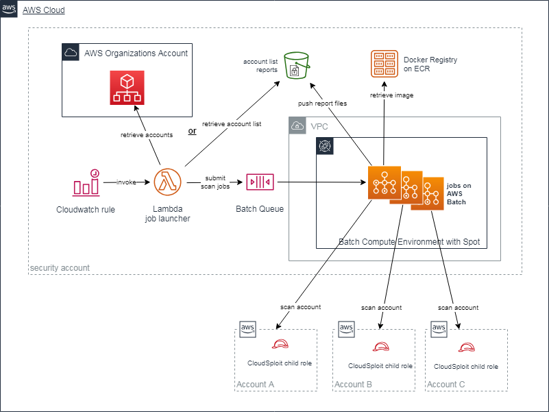

# CloudSploit Batch

CloudSploit Batch is an AWS account security scanner specialist based on [CloudSploit scanner engine](https://github.com/cloudsploit/scans) and embedded into AWS Batch jobs.

## Description

People need to audit their account to seek security issues or validate compliance. CloudSploit Batch is here to do the job for you at a defined frequency.
It ensures cost containment and security hardening.

## Technicals details

CloudSploit batch simply runs [CloudSploit scanner engines](https://github.com/cloudsploit/scans) into AWS Batch jobs.
It simply industrializes the deletion process thanks to the following AWS resources :
- CloudWatch Rule to trigger the deletion execution
- Batch to ensure a pay per use strategy
- ECR to host the Docker image that embeds CloudSploit
- Lambda to gather the accounts to perform and submit the jobs
- S3 to store generated reports
- CloudWatch Logs to log the global activity

## Prerequisites

CloudSploit needs :
- a VPC
- a private subnet with Internet connection (through a NAT Gateway)

## Installation

1. deploy the  CloudFormation stack in the central account
2. Git clone cloudsploit scans repository in the cloudsploit-batch directory
3. Build, tag and push the Docker image. Follow the information provided in the ECR repository page.
4. deploy the  in the account using AWS Organizations.
5. deploy the  in all the spoke accounts to scan. To make it easy, use StackSets Stacks from the AWS Organizations level.
6. deploy the  CloudFormation stack in the central account

Do not forget two different strong ExternalIds like UUID (one for Organizations role, one for scan role)

## How to use it
Scans are perform on a configured daily basis and reports are stored in the S3 bucket.
